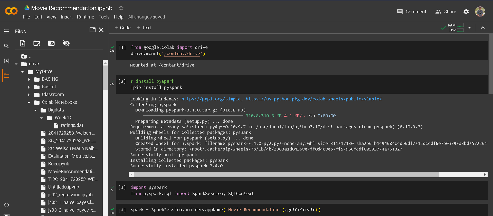
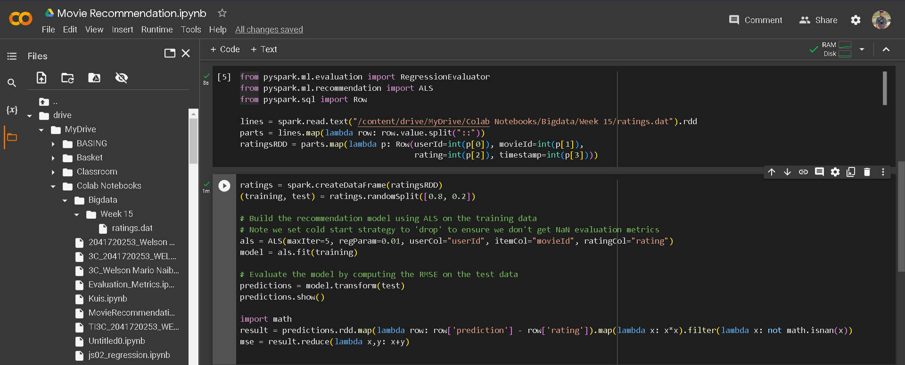
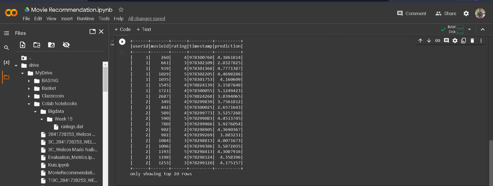
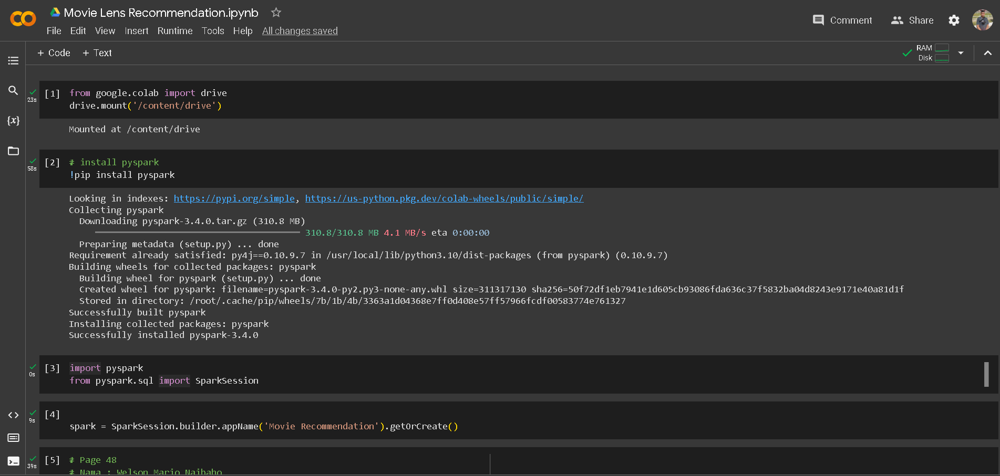
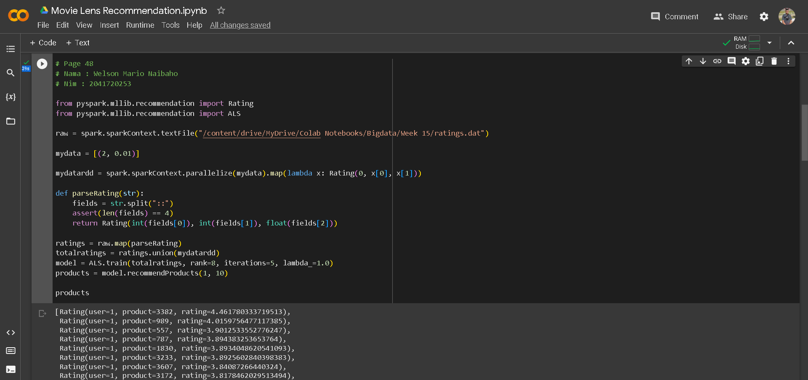
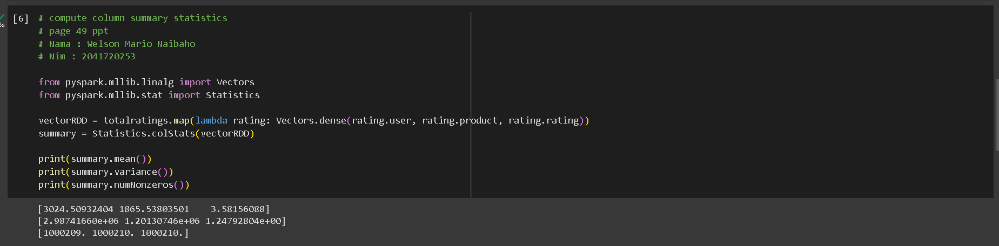
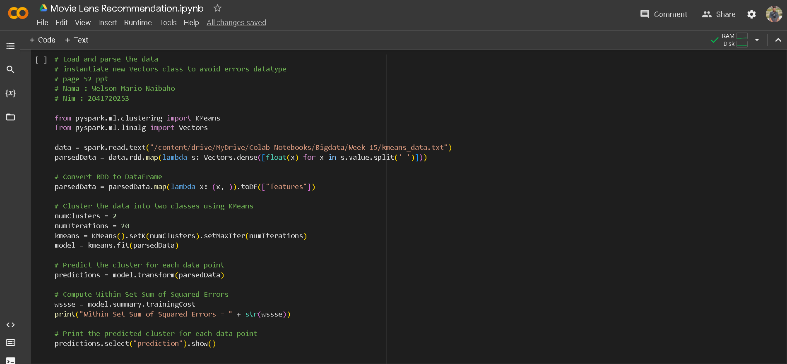
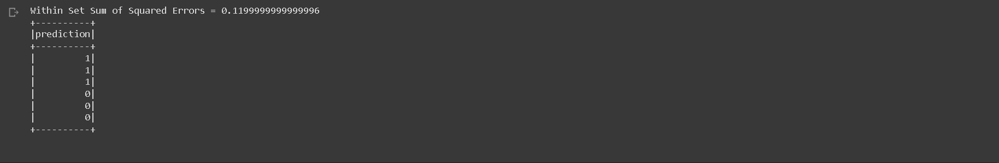
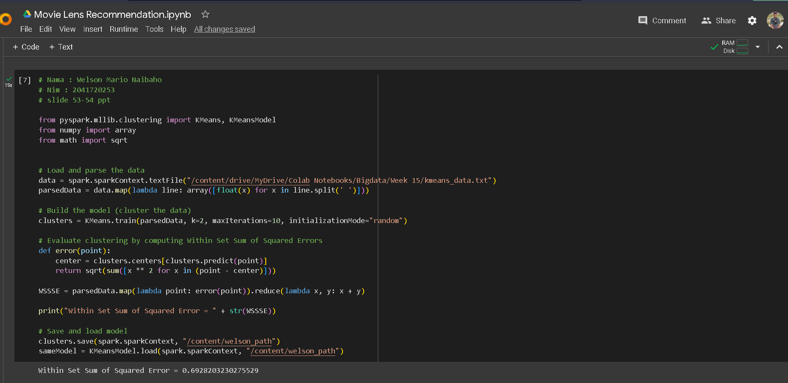
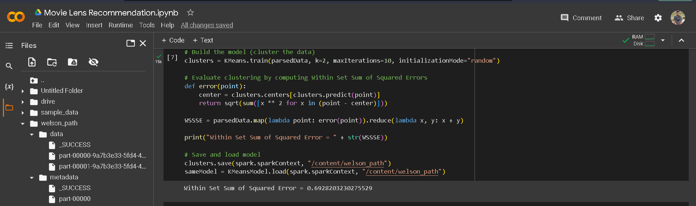

# SPARK MACHINE LEARNING
NAMA : Welson Mario Naibaho

KELAS : TI 3C

NIM : 2041720253

MATAKULIAH : BIG DATA
# TUGAS 7 - Pertemuan 14
# PRAKTIKUM / LANGKAH-LANGKAH

### 1. PAGE 30 - Movie Lens Recomendation
- Akses Google drive, kemudian install dan menjalankan session baru dari pyspark

- setiap baris dalam RDD dibagi menjadi bagian-bagian dan diubah menjadi object row yang sesuai dengan atribut userID

- output

### PAGE 48
- Akses google drive, kemudian install dan menjalankan session baru dari pyspark

- Mengubah data ratings.dat mejadi objek Rating, data baru juga ditambahkan ke RDD. model digunakan untuk merekomendasikan 10 produk kepada pengguna

### PAGE 49 
- Mengubah data totalratings menjadi vektor, kemudian menghitung statistik ringkasan rata-rata, varian, dan jumlah elemen nol-nol dari vektor menggunakan statistics.colstats

- kemudian hasil ditampilkan

### PAGE 52
- Melakukan klastering dengan algoritma K-means 
- data diubah menjadi vektor, kemudian model k-means ditrain dan digunakan untuk melakukan prediksi klaster.
- kemudian hasil within set sum of squared errors (wssse) dihitung dan di cetak

- kemudian klaster yang diprediksi ditampilkan

### PAGE 53-54
- Melakukan klastering dengan K-means
- data dibaca dan buat menjadi array, kemudian K-means dibuat untuk mengklasterkan data ke dalam dua klaster.
- kemudian menghitung within set sum of squared errors.

- kemudian terlihat disamping kiri sudah terbentuk file clusters pada folder <code>welson_path</code>
